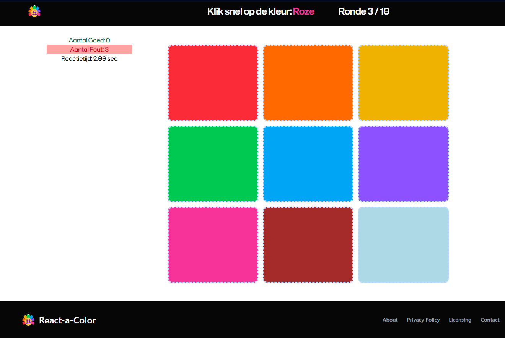

# Webbio KleurGame

Korte omschrijving  
Webbio KleurGame is een kleine React + TypeScript + Vite applicatie: je ziet bovenaan een kleurnaam en moet zo snel mogelijk het juiste kleurvak in het grid aanklikken. Het spel meet je reactietijd, houdt je score bij en draait over 10 rondes.

## Screenshot 



## Technologieën
- React
- TypeScript
- Vite
- TailwindCSS

## Vereisten
- Node.js 16+

## Installatie
1. Repository clonen:
   ```bash
   git clone https://github.com/KyanKersten/Webbio_KleurGame.git
   cd Webbio_KleurGame
   ```

2. Dependencies installeren:
   ```bash
   npm install
   ```

## Development (lokale server)
Open een terminal en voer vervolgens de volgende command uit:
```bash
npm run dev
```
Open daarna http://localhost:5173 (of de URL die Vite in de terminal toont).

## Build en preview
Maak een productiebuild en bekijk die lokaal:
```bash
npm run build
npm run preview
```
Preview opent meestal op http://localhost:4173/.

## Spelregels (kort)
- Een kleurnaam verschijnt bovenin; klik zo snel mogelijk het juiste vak.
- Correct antwoord verhoogt "goed"-teller, fout of timeout verhoogt "fout"-teller.
- Reactietijd wordt per ronde gemeten en weergegeven.
- Een sessie bevat 10 rondes;
- Je kunt het spel opnieuw starten via de reset-knop aan het eind van het spel.
